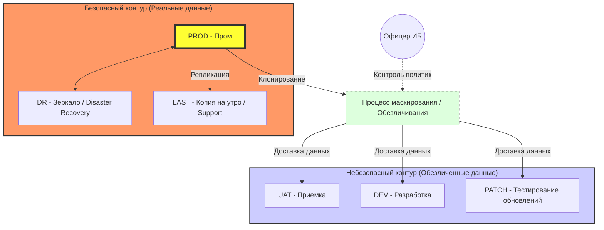
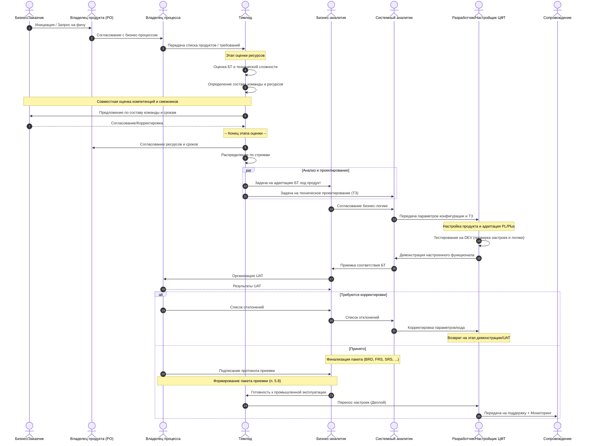
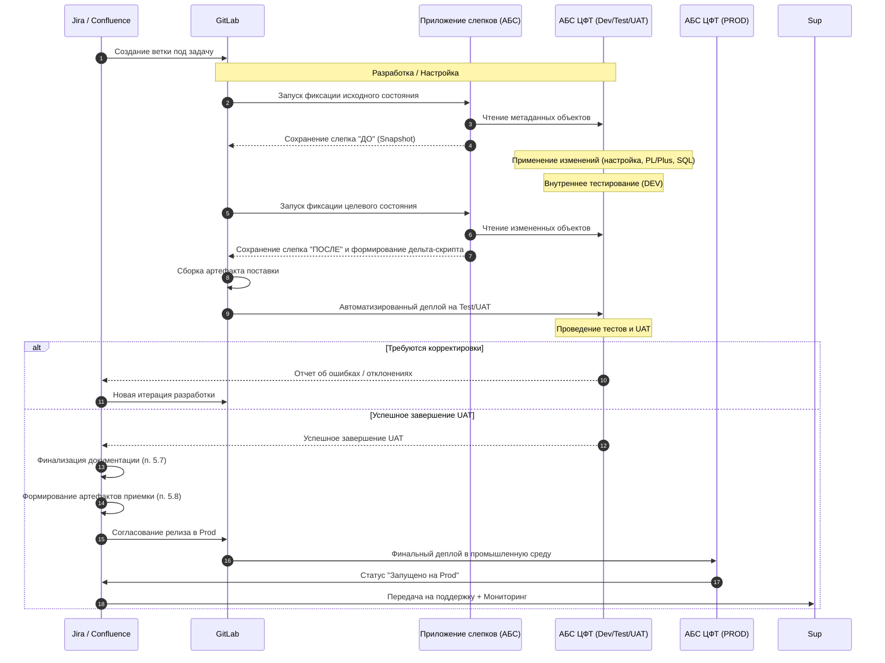
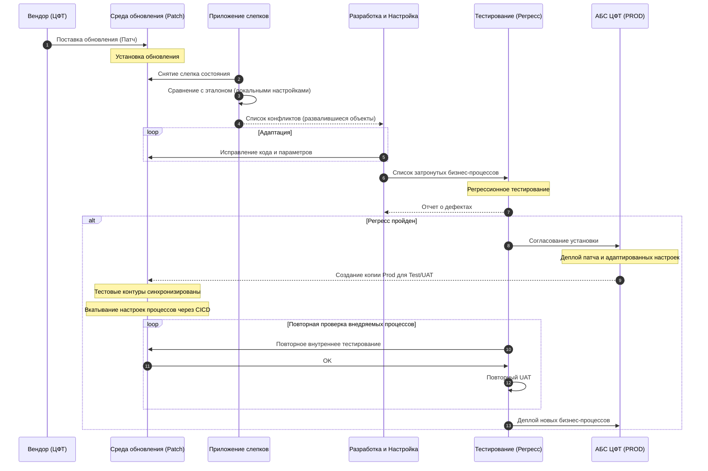
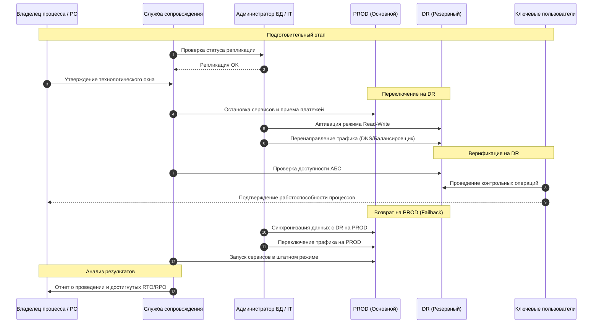

# Сценарий внедрения бизнес-процессов в АБС ЦФТ

Этот документ описывает базовый сценарий автоматизации бизнес-процессов на базе АБС ЦФТ и взаимодействие команды.

---

## 1. Команда и роли

На первом этапе производится формирование состава команды и распределение ответственности.

### 1.1. Ролевая модель
*   **Владелец продукта (Product Owner)**: Определение стратегии развития продукта, управление бэклогом, приоритизация задач, максимизация ценности продукта для бизнеса. 
*   **Владелец процесса (Process Owner)**: Ответственный за бизнес-результат, определение KPI, согласование ключевых решений, финальная приемка.
*   **Тимлид (TL)**: Ревью требований, координация ресурсов, утверждение релиза, управление SDLC и STLC. Является владельцем процессов SDLC и STLC. Осуществляет тотальный контроль всех этапов; должен обладать наиболее глубокими знаниями о логике работы и устройстве всего внедряемого функционала. Занимается планированием совместно с Заказчиком, Владельцем процесса и Владельцем продукта. Выполняет оценку БТ, технической сложности и определяет состав команды. Управляет процессом разработки и настройки, проводит ревью кода.
*   **Бизнес-аналитик (BA)**: Сбор требований, формирование БТ (Бизнес-требований/BRD), организация UAT.
*   **Системный аналитик (SA)**: Проектирование технического решения (ТЗ/FRS/SRS), согласование реализации, приемка от разработчика.
*   **Разработчик ЦФТ (Dev)**: Реализация логики в среде ЦФТ (PL/Plus), конфигурация параметров продукта, проведение внутреннего тестирования на DEV.
    *   *Примечание: Роли **SA** и **Dev** могут быть совмещены одним сотрудником при наличии соответствующих компетенций.*
*   **Служба сопровождения (Support)**: Приемка функционала на поддержку и мониторинг, эксплуатация в промышленной среде, решение инцидентов.
*   **Офицер информационной безопасности (Security Officer)**: Определение политик безопасности, контроль доступа к данным, согласование процессов обезличивания (маскирования) данных в небезопасных контурах.

### 1.2. Жизненный цикл разработки и настройки (SDLC)
Процесс разработки и настройки в АБС ЦФТ адаптирован под использование CI/CD и инструментов версионности:
1.  **Анализ и требования**: Формирование BRD и проектирование технических спецификаций.
2.  **Планирование**: Создание веток в GitLab и задач в Jira.
3.  **Снятие исходного слепка**: Фиксация состояния объектов АБС «ДО» внесения изменений.
4.  **Разработка и настройка**: Написание кода PL/Plus и конфигурация объектов на среде DEV.
5.  **Внутреннее тестирование на DEV**: Проверка работоспособности разработчиком/настройщиком.
6.  **Снятие целевого слепка и дельта-скрипт**: Фиксация состояния «ПОСЛЕ» и автоматическая сборка артефакта поставки.
7.  **CI/CD Деплой**: Автоматизированная доставка на тестовые контуры (Test/UAT).

### 1.3. Жизненный цикл тестирования (STLC)
Тестирование проводится параллельно и последовательно этапам разработки и настройки:
1.  **Анализ базиса тестирования**: Ревью требований (BRD/FRS) и подготовка карты тестирования.
2.  **Проектирование тестов**: Создание тест-кейсов.
3.  **Внутреннее (модульное) тестирование**: Проводится разработчиком/настройщиком на среде DEV перед передачей в GitLab.
4.  **Функциональное/Интеграционное тестирование**: Проверка на среде Test системными аналитиками.
5.  **Приемка (UAT)**: Тестирование бизнес-пользователями на среде UAT.
6.  **Регрессионное тестирование**: Обязательный этап при установке вендорских патчей или крупных изменениях.
7.  **Завершение цикла**: Подписание протокола и финализация тест-кейсов для передачи на поддержку.

### 1.4. Методология и ритм работы
Процесс внедрения и настройки бизнес-процессов базируется на гибких методологиях с четким ритмом встреч и системой метрик для управления эффективностью:
*   **Kanban с итерациями**: Работа ведется по методологии Kanban, при этом весь процесс разбит на итерации длительностью **2 недели**.
*   **Time To Market (TTM)**: На базе Kanban-доски вычисляется показатель TTM. Метрики собираются на уровне **Эпика** и всех связанных с ним **задач (tasks)**. Это позволяет анализировать полное время прохождения задачи («от идеи до прода») с детализацией по каждому этапу (анализ, настройка, тестирование, UAT).
*   **Классификация по сложности**: Все задачи и Эпики (бизнес-процессы) подлежат обязательной оценке сложности:
    *   **Простая** задача/процесс.
    *   **Средняя** задача/процесс.
    *   **Сложная** задача/процесс.
    *   *Цель*: Накопление статистики по TTM в разрезе сложности позволяет Тимлиду и Заказчику более точно планировать ресурсы и сроки реализации будущих задач.
*   **Ежедневные дейли (Daily)**: Команда внедрения/разработки проводит ежедневные краткие встречи для синхронизации статусов, обсуждения планов на день и выявления блокирующих факторов.
*   **Демо (Demo)**: В конце каждой итерации проводится демонстрация проделанной работы заинтересованным лицам и владельцу процесса.
*   **Тематические встречи (Brainstorming)**: Ежедневно (при необходимости) организуются встречи для глубокого разбора нового функционала, проектирования архитектуры или решения возникших проблем.

---

## 2. Карта работы с площадками

Для обеспечения надежности и безопасности процесса внедрения используется распределенная архитектура сред (площадок).

### 2.1. Описание площадок
*   **PROD (Production)**: Основная промышленная среда, где работают реальные пользователи и обрабатываются живые данные.
*   **DR (Disaster Recovery)**: Зеркало (резервная копия) промышленной среды. Предназначена для обеспечения отказоустойчивости в случае сбоя основной площадки.
*   **LAST (Support Base)**: Актуальная копия PROD на утро текущего дня. Используется службой сопровождения для оперативного воспроизведения инцидентов и разбора проблем без риска для живой базы.
*   **UAT (User Acceptance Testing)**: Среда для проведения пользовательского тестирования. Обновляется (синхронизируется с PROD) по требованию или после крупных обновлений промышленного контура.
*   **DEV (Development)**: Среда первичной настройки и разработки. Здесь происходит конфигурация продуктов и написание кода.
*   **PATCH (Update Testing)**: Выделенная среда для тестирования патчей вендора (АБС ЦФТ). Позволяет анализировать влияние обновлений в изоляции от текущей разработки.

### 2.2. Контуры безопасности и работа с данными
Все базы данных являются копиями промышленной среды, однако они разделены на два типа контуров:

1.  **Безопасный контур**:
    *   **Состав**: PROD, DR, LAST.
    *   **Данные**: Не обезличены (содержат реальные персональные данные и банковскую тайну).
    *   **Доступ**: Строго ограничен (только служба сопровождения и авторизованный персонал).

2.  **Небезопасный контур**:
    *   **Состав**: UAT, DEV, PATCH и другие тестовые среды.
    *   **Данные**: **Обязательно обезличиваются (маскируются)** при накате свежей копии с PROD.
    *   **Доступ**: Разработчики, аналитики, внешние консультанты.

**Важно**: Процесс и алгоритмы обезличивания (маскирования) данных должны быть проработаны и согласованы с **Офицером информационной безопасности**.

### 2.3. Схема взаимодействия площадок

---

## 3. Стратегия внедрения купленных продуктов

Поскольку внедряются купленные продукты ЦФТ, основной упор делается на конфигурацию и интеграцию, а не на разработку с нуля.

### 3.1. Очередность и приоритезация
Тимлид совместно с Бизнес-заказчиком, Владельцем процесса и Владельцем продукта определяет приоритеты на основе ценности для бизнеса и технических зависимостей:
1.  **Ядро и Базовые модули**: Настройка общих справочников, учетных схем и базовых продуктовых линеек.
2.  **Зависимые сервисы**: Модули, требующие настроенного ядра (например, расчетные модули, отчетность).
3.  **Специфический функционал**: Узкоспециализированные продукты и кастомные доработки.

### 3.2. Распараллеливание процесса внедрения
Для ускорения реализации бизнес-процесса Тимлид выполняет его декомпозицию и распределяет ресурсы по независимым потокам (стримам) внутри одного процесса:

*   **Стрим А (Ядро и бизнес-логика)**: 
    *   Настройка базовых объектов (счета, справочники).
    *   Реализация алгоритмов и процедур на PL/Plus.
    *   Настройка правил обработки операций.
*   **Стрим Б (Экранные формы и интерфейс)**: 
    *   Проектирование и настройка пользовательских интерфейсов.
    *   Настройка валидаций на уровне форм.
    *   Адаптация визуальных компонентов под требования БТ.
*   **Стрим В (Интеграции и шлюзы)**: 
    *   Настройка внешних интерфейсов и API.
    *   Конфигурация шлюзов обмена данными.
    *   Маппинг данных между ЦФТ и внешними системами.
*   **Стрим Г (Отчетность и печатные формы)**:
    *   Разработка макетов документов.
    *   Настройка выгрузок и аналитических отчетов по процессу.

Такая декомпозиция позволяет аналитикам и разработчикам работать над разными частями одного бизнес-процесса одновременно, обеспечивая быструю сборку итогового продукта.

---

## 4. Процесс взаимодействия при внедрении (Sequence Diagram)

---

## 5. Этапы внедрения

1.  **Планирование и оценка (TL)**: Определение очередности, разделение на стримы, назначение **Владельца процесса**. Проводится совместно с Заказчиком, Владельцем продукта и Владельцем процесса. Включает обязательный этап **оценки ресурсов**, который выполняется **Тимлидом**. Тимлид самостоятельно проводит оценку БТ, технической сложности и определяет:
    *   Общий объем трудозатрат (в человеко-днях).
    *   Необходимые компетенции (требуется ли только настройка аналитиками или необходима помощь разработчиков).
    *   Необходимость привлечения ресурсов смежных команд (интеграции, безопасность, инфраструктура).
    *   Согласование предварительных сроков реализации на основе имеющихся ресурсов.
2.  **Анализ (BA/SA)**: Сбор требований и техническое проектирование под конкретный продукт.
3.  **Конфигурация/Настройка (Dev)**: Настройка параметров продукта в ЦФТ и необходимая адаптация (PL/Plus).
4.  **Тестирование (Internal Testing)**: Первичная проверка настроек и доработок командой внедрения/настройки на среде разработки (**DEV**). Включает:
    *   Проверку корректности установки объектов АБС.
    *   Функциональное тестирование реализованной логики (Unit-тесты).
    *   Проверку интеграционных стыков на минимальных наборах данных.
5.  **Цикл поставки изменений (CI/CD)**:
    *   **Jira**: Создание задач на доработку/настройку, отслеживание статусов.
    *   **Confluence**: Ведение технической документации и протоколов настроек.
    *   **GitLab**: Хранение кода PL/Plus и конфигурационных скриптов.
    *   **Первичная настройка CI/CD**: Внедрение пайплайнов для автоматизированной сборки и доставки изменений.
    *   **Снятие слепков (Snapshotting)**: Использование специализированного приложения в АБС ЦФТ для фиксации состояния объектов (метаданных) перед и после изменений для обеспечения версионности и возможности отката.
6.  **UAT**: Приемка бизнес-пользователями на тестовом контуре (UAT/Pre-prod).
7.  **Финализация пакета внедрения**: Актуализация пакета документов по результатам настройки и UAT:
    *   **BRD** (Business Requirements Document — Документ бизнес-требований).
    *   **FRS** (Functional Requirements Specification — Спецификация функциональных требований).
    *   **SRS** (Software Requirements Specification — Спецификация требований к программному обеспечению).
    *   **Тест-кейсы** (актуализированная карта тестирования).
    *   **Пользовательская документация** (инструкции).
8.  **Приемка (Acceptance)**: После успешного UAT и финализации документов формируется пакет для передачи на поддержку:
    1.  Работающий функционал (подтвержденный результатами UAT).
    2.  Подробное описание бизнес-процесса.
    3.  Функциональные и технические требования к объектам процесса.
    4.  Инструкции пользователя (руководство по работе с процессом).
    5.  Тест-кейсы (карта тестирования для регресса).
9.  **Внедрение (Prod)**: Финальный деплой артефакта в промышленную среду.
10. **Передача на сопровождение + Мониторинг (Support)**: Пост-проектное обслуживание, мониторинг и поддержка процесса в эксплуатации.

---

## 6. Цикл CI/CD и приложение снятия слепков

---

## 7. Обновление АБС ЦФТ (Установка обновлений вендора)

Процесс установки патчей и обновлений от вендора (ЦФТ) является непрерывным и идет параллельно с текущими проектами внедрения. Цель — поддержание системы в актуальном состоянии и минимизация технологического долга.

### 7.1. Специфика и этапы процесса
1.  **Установка на выделенную среду**: Обновление накатывается на отдельный контур обновления, идентичный по составу объектов текущему Prod или Test.
2.  **Снятие слепков и анализ конфликтов**:
    *   С помощью приложения снятия слепков выявляются «развалившиеся» локальные настройки и доработки.
    *   Анализируются дистрибутивные объекты, которые были изменены вендором и которые затронули наши кастомные объекты и настройки (PL/Plus, метаданные).
3.  **Адаптация**: Разработчики/настройщики адаптируют локальный код и параметры под новую структуру дистрибутива.
4.  **Регрессионное тестирование**: На основе списка затронутых объектов определяется перечень критичных бизнес-процессов для проведения регресса.

### 7.2. Синхронизация с внедрением
Для минимизации рисков при параллельном ведении настройки/разработки и обновлении системы, рекомендуется следующая схема:
1.  **Анализ зависимостей**: Если внедряемый бизнес-процесс требует функционала, который поставляется в рамках нового патча вендора, его внедрение в Prod блокируется до завершения обновления системы.
2.  **Ожидание и синхронизация**:
    *   Обновление (патч) устанавливается на Prod.
    *   **Синхронизация Test/UAT**: Тестовые контуры (Test/UAT) синхронизируются с Prod — создается актуальная **копия Prod** (на которую уже накат патч и адаптированные настройки).
    *   **Восстановление настроек процессов**: С помощью **CI/CD** на обновленные тестовые контуры повторно вкатываются все настройки внедряемых бизнес-процессов (используя накопленные дельта-скрипты и слепки).
3.  **Повторное тестирование**:
    *   На обновленном тестовом контуре проводится повторное внутреннее тестирование (регресс функционала процесса).
    *   Проводится повторный (сокращенный или полный) **UAT** для подтверждения корректности работы процесса на новой версии АБС.
4.  **Деплой**: Только после успешного повторного UAT процесс допускается к внедрению в Prod.

### 7.3. Диаграмма процесса обновления

---

## 8. Организация и проведение DR-сценария (Disaster Recovery)

Для обеспечения непрерывности бизнеса и подтверждения технической возможности восстановления систем в случае масштабных аварий, ежегодно проводится процедура DR-сценария.

### 8.1. Цели и периодичность
*   **Периодичность**: Минимум один раз в год.
*   **Основная цель**: Практическое подтверждение времени восстановления (RTO) и точки восстановления данных (RPO) согласно SLA.
*   **Задачи**: Проверка целостности данных на DR-площадке, подтверждение работоспособности всех бизнес-процессов в условиях переключения, тренировка персонала.

### 8.2. План проведения DR-сценария
1.  **Подготовительный этап**:
    *   Проверка актуальности репликации данных между PROD и DR.
    *   Согласование технологического окна с владельцами бизнес-процессов и Product Owner.
2.  **Переключение на DR**:
    *   Остановка приема платежей и операций на основном контуре PROD.
    *   Активация DR-площадки (перевод базы данных из режима Standby в Read-Write).
    *   Перенаправление трафика пользователей и внешних систем на узлы DR.
3.  **Верификация**:
    *   Проверка доступности объектов АБС ЦФТ.
    *   Служба сопровождения и ключевые пользователи проводят контрольные операции («сквозные» тесты) по критичным бизнес-процессам.
4.  **Возврат на PROD (Failback)**:
    *   Синхронизация накопленных изменений с DR обратно на основную площадку.
    *   Возобновление работы в штатном режиме.
5.  **Анализ результатов**:
    *   Формирование отчета о проведении DR-сценария.
    *   Актуализация инструкций по восстановлению (при выявлении отклонений).

### 8.3. Диаграмма DR-сценария

