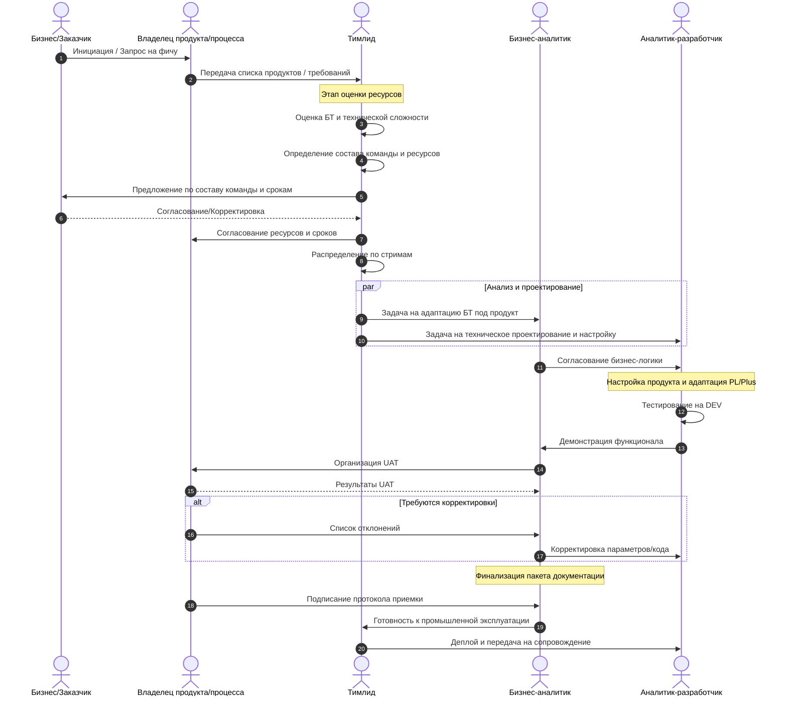
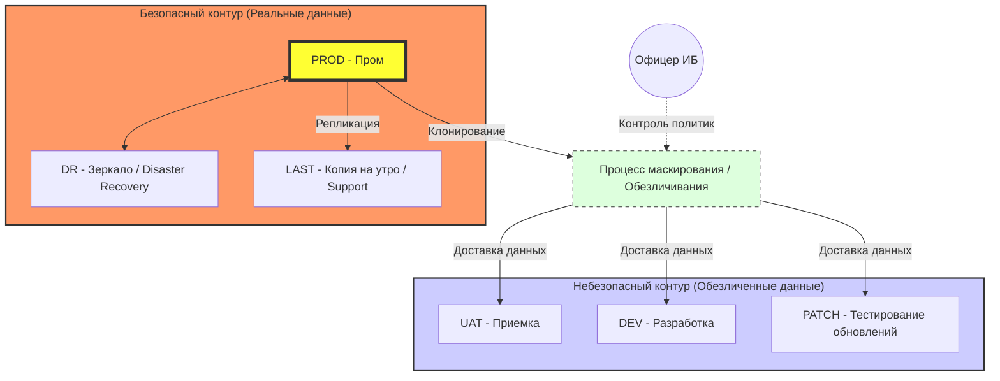
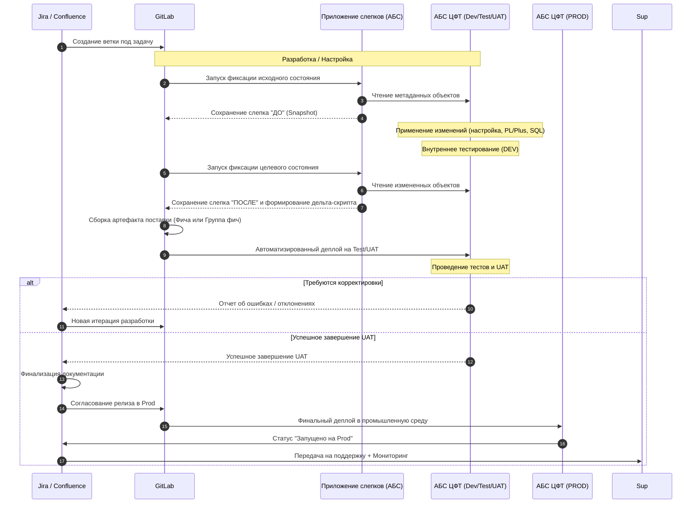
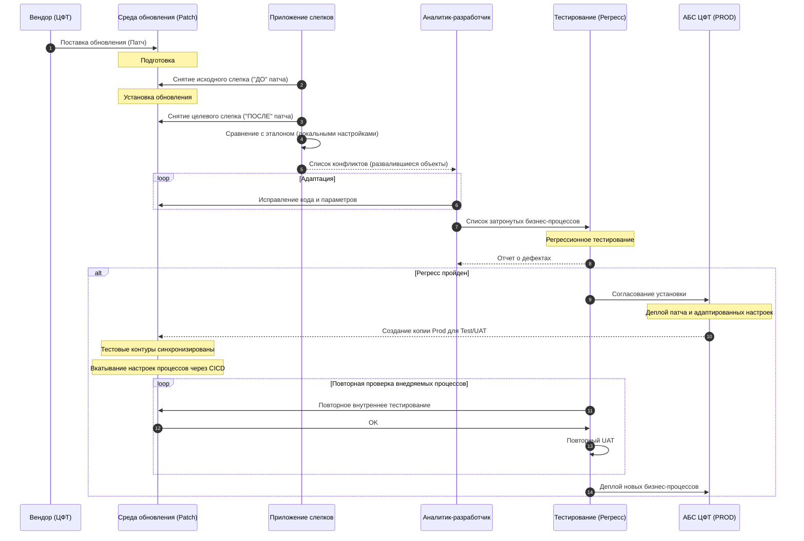
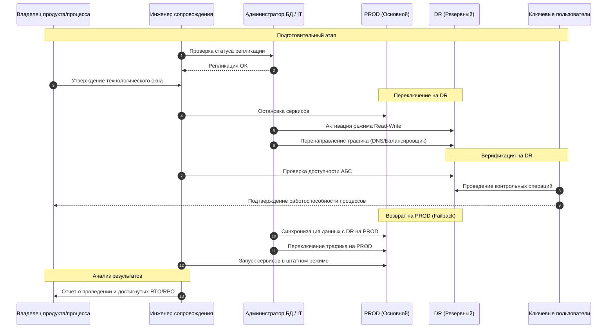

# Сценарий внедрения бизнес-процессов в АБС ЦФТ (Редакция)

## 0. Архитектурные и лицензионные ограничения

Процесс внедрения и эксплуатации АБС ЦФТ (Платформа 1) ограничен рядом технологических и архитектурных особенностей:

1.  **СУБД Oracle**: Система развернута и функционирует исключительно на базе системы управления базами данных Oracle.
2.  **Обновление системы (Вендорские патчи)**: Глобальное обновление ядра или дистрибутивных модулей системы невозможно без технологического окна. Процесс требует полного перевода АБС в режим недоступности для пользователей и внешних систем на время проведения работ.
3.  **Локальные доработки**: Установка локальных настроек и доработок (кастомный код PL/Plus, метаданные) теоретически возможна без полной остановки всех сервисов, однако требует обязательного согласованного технологического окна для минимизации рисков и корректной компиляции объектов.
4.  **Ограничения дистрибутивного кода и производительность**: Невозможно гарантировать производительность дистрибутивного функционала «из коробки». В случае, если вендор поставляет код, который невозможно адаптировать через стандартные механизмы расширений или «хуков» (hooks), его изменение легальными способами без специального ключа разработчика ЦФТ невозможно. Исправление таких ситуаций требует официального обращения в службу поддержки вендора, что создает существенные риски задержек и может напрямую повлиять на сроки обновления промышленного контура (PROD).
5.  **Перспективы сокращения простоев (ZDT)**: Для обеспечения доступности системы в режиме 24/7 существует специализированное решение от вендора — [ZDT (Zero Down Time)](https://catalog.cft.ru/applications/card/ZDT.MV). Данный инструмент потенциально позволяет существенно сократить время простоя при обновлениях. Однако на текущий момент опыт эксплуатации этого инструмента в команде отсутствует, поэтому подтвердить его реальную эффективность и применимость в наших условиях пока невозможно.
6.  **Стоимость лицензий среды разработки ([IDE ЦФТ](https://catalog.cft.ru/applications/card/IDE_DBI))**: Высокая стоимость лицензий IDE ЦФТ на каждое рабочее место разработчика и на каждый экземпляр GitLab Runner накладывает существенные финансовые ограничения на масштабирование команды и инфраструктуры автоматизации. Это требует максимально эффективного использования имеющихся лицензий и тщательного планирования при расширении штата или увеличении количества параллельных пайплайнов в CI/CD.
7.  **Жизненный цикл Платформы 1 и риски миграции**: ЦФТ Платформа 1 является устаревающей технологией. Существуют риски завершения ее жизненного цикла и прекращения выпуска обновлений вендором в среднесрочной перспективе. Это повлечет за собой необходимость перехода на новые платформы — **ЦФТ 2MCA** >> **ЦФТ DBI**. 
    *   **Невозможность прямого перехода**: Прямой переход («прыжок») с Платформы 1 сразу на ЦФТ DBI технически невозможен. ЦФТ DBI базируется на платформе 2MCA, поэтому миграция должна выполняться последовательно.
    *   **Масштабность проектов**: Переход с одной платформы на другую представляет собой масштабный проект с высокими трудозатратами и длительными сроками реализации.
    *   **Риски перелицензирования**: При переходе на новые платформы возникают риски повторного лицензирования объектов системы, а также инструментов разработки и анализа.
    *   **Инфраструктурные особенности**: Каждая платформа требует собственной выделенной инфраструктуры. И ЦФТ 2MCA, и ЦФТ DBI работают в трехзвенной архитектуре. ЦФТ 2MCA базируется на СУБД Oracle. ЦФТ DBI ориентирована на работу с PostgreSQL, но требует использования не «ванильной» версии, а строго определенной сборки, указанной вендором.

---

## 1. Стартовые технические работы

Работы по реализации базовой технологической инфраструктуры могут проводиться параллельно с формированием и запуском команды. Эти решения являются фундаментом для обеспечения качества и скорости внедрения.

### 1.1. Локальные доработки в ЦФТ (Технологический фундамент)
1.  **Приложение снятия слепков объектов**: Реализация специализированного инструмента для фиксации состояния объектов словаря данных ЦФТ. Система должна работать в тесной связке с пайплайнами **CI/CD GitLab** для стабильной автоматизации, ускорения установки обновлений и деплоя локальных доработок.
2.  **Универсальный логгинг**: Разработка и внедрение механизма универсального лога. В данный лог должны транслироваться все критические ошибки для оперативного мониторинга бизнес-процессов и технического состояния системы.
3.  **Интеграционный слой**: Проектирование и настройка отказоустойчивого интеграционного слоя на базе следующего технологического стека:
    *   **JSON-RPC 2.0**: Протокол обмена данными.
    *   **Oracle AQ (Advanced Queuing)**: Внутрибазовые очереди сообщений.
    *   **Apache Kafka**: Распределенная шина обмена сообщениями для интеграции с внешними системами.
4.  **Библиотека автотестирования**: Разработка и развитие внутренней библиотеки/фреймворка для написания автотестов. Инструмент должен позволять команде создавать воспроизводимые тесты бизнес-логики на уровне PL/Plus и интеграционных стыков, обеспечивая стабильное качество при регулярных обновлениях и доработках.
5.  **Утилита командной строки (CLI) и ОС-скрипты**: Разработка специализированной утилиты командной строки и набора скриптов управления на уровне операционной системы. 
    *   **Назначение**: Обеспечение унифицированного взаимодействия между внешними инструментами (CI/CD GitLab, IDE, локальные машины разработчиков) и АБС ЦФТ. CLI предназначен строго для задач CI/CD: автоматизация сборки, установка артефактов и управление миграциями.

### 1.2. Настройка CI/CD GitLab
Создание и конфигурация инфраструктуры для автоматизации цикла поставки и управления миграциями:
*   **Проектирование Pipeline**: Разработка структуры и логики пайплайнов для различных этапов (сборка, тестирование, деплой).
*   **Подготовка Runners**: Развертывание и настройка серверов с GitLab Runners, на которых предустановлена **IDE ЦФТ**.
*   **Технологическая обвязка**: Использование CLI и скриптов управления для взаимодействия с АБС ЦФТ и IDE (сборка, установка артефактов, управление миграциями).
*   **Автоматизация релизов**: Создание механизмов для автоматизированной поставки релизов и управления миграциями объектов АБС.
*   **Интеграция с Jira**: Настройка автоматического обновления статусов задач на основе результатов выполнения пайплайнов.

### 1.3. Аудит и ревизия ресурсов
Проведение комплексного аудита текущего состояния проекта, который включает:
*   **Инфраструктура**: Проверка достаточности и готовности серверных мощностей, дисковых подсистем и сетевой связности. Оценка количества и состава имеющихся площадок (DEV, TEST, UAT и т.д.).
*   **Мониторинг**: Ревизия существующих систем мониторинга (Zabbix, Prometheus, Grafana и др.). Определение того, какие компоненты уже подключены, какие метрики собираются, и выявление зон, где мониторинг отсутствует или недостаточен.
*   **Лицензионная чистота**: Анализ имеющихся лицензий на ПО (Oracle, ЦФТ, системное ПО) для понимания лимитов и ограничений.
*   **Договорная база**: Ревизия договоров с вендором и смежниками для определения границ ответственности, условий поддержки и обновлений.
*   *Цель*: Четкое понимание текущих возможностей, выявление дефицита ресурсов и формализация существующих ограничений на раннем этапе.

### 1.4. Формирование баз знаний и регламентов
Создание и наполнение двух ключевых информационных ресурсов для обеспечения прозрачности и унификации работы:

1.  **Командная техническая база знаний**:
    *   **Технические особенности**: Описание архитектуры, интеграций и специфики настройки системы.
    *   **Управление площадками**: Описание состава и назначения сред (DEV, TEST, UAT и т.д.).
    *   **Стандарт локальных доработок**: Регламенты написания кода, ведения объектов и версионирования.
    *   **Инструкции CI/CD**: Руководства по работе с пайплайнами, сборке и деплою.
    *   **Библиотека автотестирования**: Методология написания тестов, работа с фреймворком и примеры.
    *   **DR сценарий**: Регламент и инструкции по проведению учений и восстановлению системы в случае аварии.
    *   **Матрицы компетенций**: Определение уровней экспертизы сотрудников и зон ответственности.

2.  **Бизнес-база знаний (Единая точка правды)**:
    *   **Бизнес-процессы**: Визуализация и описание текущих и целевых бизнес-процессов.
    *   **Управление требованиями**: Методология ведения бизнес-требований (BRD), функциональных (FRS) и нефункциональных (NFR) требований.
    *   **Развитие системы**: Главный ресурс для управления изменениями, позволяющий отслеживать эволюцию бизнес-логики и обеспечивать актуальность документации.

## 2. Команда и роли

На первом этапе производится формирование состава команды и распределение ответственности.

> [!TIP]
> Сбор квалифицированной команды и четкое распределение ролей на старте проекта критически важны для минимизации рисков дублирования функций, исключения зон безответственности и обеспечения прозрачного взаимодействия между бизнесом и ИТ-подразделениями. Без четко определенных ролей невозможно эффективное управление SDLC и соблюдение сроков TTM.

### 1.1. Ролевая модель
*   **Владелец продукта / Владелец процесса (Product / Process Owner)**: Определение стратегии развития продукта, управление бэклогом, приоритизация задач, максимизация ценности продукта для бизнеса. Ответственный за бизнес-результат, определение KPI, согласование ключевых решений, финальная приемка.
*   **Тимлид (TL)**: Ревью требований, координация ресурсов, утверждение релиза, управление SDLC и STLC. Является владельцем процессов SDLC и STLC. Осуществляет тотальный контроль всех этапов; должен обладать наиболее глубокими знаниями о логике работы и устройстве всего внедряемого функционала. Занимается планированием совместно с Заказчиком, Владельцем процесса и Владельцем продукта. Выполняет оценку БТ, технической сложности и определяет состав команды. Управляет процессом разработки и настройки, проводит ревью кода.
*   **Бизнес-аналитик (BA)**: Сбор требований, формирование БТ (Бизнес-требований/BRD), организация UAT.
*   **Аналитик-разработчик / Инженер сопровождения**: Проектирование технического решения (ТЗ/FRS/SRS), согласование реализации, приемка от разработчика. Реализация логики в среде ЦФТ (PL/Plus), конфигурация параметров продукта, проведение внутреннего тестирования на DEV. Приемка функционала на поддержку и мониторинг, эксплуатация в промышленной среде, решение инцидентов.
*   **Офицер информационной безопасности (Security Officer)**: Определение политик безопасности, контроль доступа к данным, согласование процессов обезличивания (маскирования) данных в небезопасных контурах.

### 1.2. Методология и ритм работы
Процесс внедрения и настройки бизнес-процессов базируется на гибких методологиях с четким ритмом встреч и системой метрик для управления эффективностью, однако выбор методологии зависит от типа задач:

*   **Kanban с итерациями**: Стандартная разработка и настройка бизнес-процессов ведется по методологии Kanban, при этом весь процесс разбит на итерации длительностью **2 недели**.
*   **Waterfall (Водопадная модель) для регуляторных задач**: Все задачи, связанные с регуляторными требованиями (законодательство, требования ЦБ и т.д.), выполняются строго по водопадному методу. Такие задачи должны иметь:
    *   Четко фиксированный план-график.
    *   Выделенные и забронированные ресурсы.
    *   Жестко определенные даты вывода функционала в промышленную эксплуатацию (PROD).
*   **Time To Market (TTM)**: На базе Kanban-доски вычисляется показатель TTM. Метрики собираются на уровне **Эпика** и всех связанных с ним **задач (tasks)**. Это позволяет анализировать полное время прохождения задачи («от идеи до прода») с детализацией по каждому этапу (анализ, настройка, тестирование, UAT).
*   **Классификация по сложности**: Все задачи и Эпики (бизнес-процессы) подлежат обязательной оценке сложности:
    *   **Простая** задача/процесс.
    *   **Средняя** задача/процесс.
    *   **Сложная** задача/процесс.
    *   *Цель*: Накопление статистики по TTM в разрезе сложности позволяет Тимлиду и Заказчику более точно планировать ресурсы и сроки реализации будущих задач.
*   **Ежедневные дейли (Daily)**: Команда внедрения/разработки проводит ежедневные краткие встречи для синхронизации статусов, обсуждения планов на день и выявления блокирующих факторов.
*   **Демо (Demo)**: В конце каждой итерации проводится демонстрация проделанной работы заинтересованным лицам и владельцу процесса.
*   **Тематические встречи (Brainstorming)**: Ежедневно (при необходимости) организуются встречи для глубокого разбора нового функционала, проектирования архитектуры или решения возникших проблем.

> [!TIP]
> Крайне важно вести расчет TTM даже при наличии большого количества незапланированных (входящих) задач. Накопленная статистика со временем станет объективным индикатором производительности команды и позволит наглядно отслеживать прогресс эффективности процессов внедрения.

### 1.3. Работа с бэклогом
Управление бэклогом является совместной задачей Владельца продукта (PO) и Тимлида (TL), где PO отвечает за «Что» и «Зачем», а TL за «Как» и «Когда».

1.  **Стратегическое планирование (Epics)**:
    *   **Владелец продукта** формирует перечень крупных бизнес-задач и проектов в виде **Эпиков (Epics)**.
    *   Планирование на уровне Эпиков осуществляется в долгосрочной перспективе (от полугода до года) на основе ценности для бизнеса и KPI.
2.  **Декомпозиция и уточнение**:
    *   На этапе анализа и проектирования **Тимлид** совместно с аналитиками производит декомпозицию Эпика на отдельные **Задачи (Tasks)**.
    *   **Владелец продукта** участвует в уточнении требований и критериев приемки (Acceptance Criteria) для задач.
3.  **Приоритезация и маневрирование**:
    *   При наличии свободных ресурсов декомпозированные задачи могут браться в работу в параллельном режиме, что позволяет существенно сократить общий TTM процесса.
    *   В случае появления незапланированных срочных задач и при отсутствии свободных ресурсов, **Владелец продукта** принимает финальное решение о приоритизации: какие текущие задачи будут приостановлены для переброски ресурсов на срочный таск.
4.  **Контроль ценности**:
    *   **Владелец продукта** регулярно пересматривает бэклог (Backlog Refinement) для обеспечения актуальности задач и их соответствия текущим целям бизнеса.

## 3. Стратегия и процесс внедрения продуктов

Поскольку внедряются купленные продукты ЦФТ, основной упор делается на конфигурацию и интеграцию, а не на разработку с нуля.

### 3.1. Очередность и приоритезация
Тимлид совместно с Бизнес-заказчиком и Владельцем продукта/процесса определяет приоритеты на основе ценности для бизнеса и технических зависимостей:
1.  **Ядро и Базовые модули**: Настройка общих справочников, учетных схем и базовых продуктовых линеек.
2.  **Зависимые сервисы**: Модули, требующие настроенного ядра (например, расчетные модули, отчетность).
3.  **Специфический функционал**: Узкоспециализированные продукты и кастомные доработки.

### 3.2. Распараллеливание процесса внедрения
Для ускорения реализации бизнес-процесса Тимлид выполняет его декомпозицию и распределяет ресурсы по независимым потокам (стримам) внутри одного процесса:
*   **Стрим А (Ядро и бизнес-логика)**: Настройка базовых объектов, реализация алгоритмов на PL/Plus.
*   **Стрим Б (Экранные формы и интерфейс)**: Проектирование и настройка пользовательских интерфейсов.
*   **Стрим В (Интеграции и шлюзы)**: Настройка внешних интерфейсов, API и маппинг данных.
*   **Стрим Г (Отчетность и печатные формы)**: Разработка макетов документов и аналитических выгрузок.

### 3.3. Процесс взаимодействия (Sequence Diagram)

### 3.4. Этапы внедрения
1.  **Планирование и оценка (TL)**: Оценка БТ, сложности и ресурсов.
2.  **Анализ (BA/Dev)**: Сбор требований и техническое проектирование.
3.  **Конфигурация и Настройка (Dev)**: Настройка параметров и адаптация PL/Plus.
4.  **Внутреннее тестирование (Dev)**: Проверка на среде DEV.
5.  **Цикл поставки (CI/CD)**: Работа с Jira, Git и снятие слепков.
6.  **UAT**: Приемка бизнес-пользователями.
7.  **Финализация документации**: Актуализация BRD, FRS, SRS и тест-кейсов.
8.  **Приемка и Внедрение (Prod)**: Финальный деплой.
9.  **Сопровождение и Мониторинг**: Пост-проектная поддержка.

### 3.5. Автотестирование и обеспечение качества
Для обеспечения стабильности системы и ускорения циклов поставки (включая регресс при вендорских обновлениях) внедряется обязательный процесс автоматизированного тестирования. 

Разработка автотестов позволяет проводить сквозной регресс критичных бизнес-процессов в кратчайшие сроки, минимизируя ручной труд и вероятность ошибок.

> [!TIP]
> Внедрение полноценного автотестирования — это высокотехнологичный и трудозатратный процесс, требующий выделенных ресурсов как со стороны разработки, так и со стороны QA-инженеров. Однако при таком подходе устанавливается жесткий стандарт качества: **все будущие бизнес-процессы должны проходить строго через автоматизированное тестирование**. Не допускается вывод в эксплуатацию функционала, не покрытого автотестами.

## 4. Карта работы с площадками

Для обеспечения надежности и безопасности процесса внедрения используется распределенная архитектура сред (площадок).

### 4.1. Описание площадок
*   **PROD (Production)**: Основная промышленная среда, где работают реальные пользователи и обрабатываются живые данные.
*   **DR (Disaster Recovery)**: Зеркало (резервная копия) промышленной среды. Предназначена для обеспечения отказоустойчивости в случае сбоя основной площадки.
*   **LAST (Support Base)**: Актуальная копия PROD на утро текущего дня. Используется службой сопровождения для оперативного воспроизведения инцидентов и разбора проблем без риска для живой базы.
*   **UAT (User Acceptance Testing)**: Среда для проведения пользовательского тестирования. Обновляется (синхронизируется с PROD) по требованию или после крупных обновлений промышленного контура.
*   **DEV (Development)**: Среда первичной настройки и разработки. Здесь происходит конфигурация продуктов и написание кода.
*   **PATCH (Update Testing)**: Выделенная среда для тестирования патчей вендора (АБС ЦФТ). Позволяет анализировать влияние обновлений в изоляции от текущей разработки.

### 4.2. Контуры безопасности и работа с данными
Все базы данных являются копиями промышленной среды, однако они разделены на два типа контуры:

1.  **Безопасный контур**:
    *   **Состав**: PROD, DR, LAST.
    *   **Данные**: Не обезличены (содержат реальные персональные данные и банковскую тайну).
    *   **Доступ**: Строго ограничен (только служба сопровождения и авторизованный персонал).

2.  **Небезопасный контур**:
    *   **Состав**: UAT, DEV, PATCH и другие тестовые среды.
    *   **Данные**: **Обязательно обезличиваются (маскируются)** при накате свежей копии с PROD.
    *   **Доступ**: Разработчики, аналитики, внешние консультанты.

**Важно**: Процесс и алгоритмы обезличивания (маскирования) данных должны быть проработаны и согласованы с **Офицером информационной безопасности**.

### 4.3. Схема взаимодействия площадок

## 5. Цикл CI/CD и приложение снятия слепков

Процесс поставки изменений автоматизирован с использованием Git и специализированного инструмента фиксации состояния объектов АБС.

> [!TIP]
> Автоматизация сборки и деплоя на базе слепков значительно облегчает и ускоряет процесс тестирования вендорских обновлений. В случае выявления конфликтов или отсутствия необходимых локальных настроек после наката патча, система позволяет оперативно «докатывать» недостающий функционал отдельными фичами или логическими группами.

### 5.1. Режимы поставки
Система CI/CD поддерживает гибкие сценарии деплоя:
*   **Пофиченая установка (Feature-based)**: Изолированная поставка отдельной задачи или доработки. Позволяет быстро выводить конкретный функционал, не дожидаясь готовности остальных частей Эпика.
*   **Групповая установка (Release-based / Group of features)**: Сборка и деплой пакета, включающего в себя несколько взаимосвязанных фич. Используется при массовых обновлениях или при наличии жестких технологических зависимостей между задачами.

### 5.2. Схема процесса CI/CD

## 6. Обновление АБС ЦФТ (Установка обновлений вендора)

Процесс установки патчей и обновлений от вендора (ЦФТ) является непрерывным и идет параллельно с текущими проектами внедрения. Цель — поддержание системы в актуальном состоянии и минимизация технологического долга.

### 6.1. Специфика и этапы процесса
1.  **Установка на выделенную среду**: Обновление накатывается на отдельный контур обновления (**PATCH**), идентичный по составу объектов текущему PROD.
2.  **Снятие слепков и анализ конфликтов**:
    *   С помощью приложения снятия слепков выявляются «развалившиеся» локальные настройки и доработки.
    *   Анализируются дистрибутивные объекты, которые были изменены вендором и которые затронули наши кастомные объекты и настройки (PL/Plus, метаданные).
3.  **Адаптация**: Аналитики-разработчики адаптируют локальный код и параметры под новую структуру дистрибутива.
4.  **Регрессионное тестирование**: На основе списка затронутых объектов определяется перечень критичных бизнес-процессов для проведения регресса.

### 6.2. Синхронизация с внедрением
Для минимизации рисков при параллельном ведении настройки/разработки и обновлении системы, используется следующая схема:
1.  **Анализ зависимостей**: Если внедряемый бизнес-процесс требует функционала, который поставляется в рамках нового патча вендора, его внедрение в PROD блокируется до завершения обновления системы.
2.  **Синхронизация контуров**:
    *   Патч устанавливается на PROD.
    *   Тестовые контуры (TEST/UAT) синхронизируются с PROD (создается актуальная копия с уже накатанным патчем).
    *   С помощью **CI/CD** на обновленные контуры повторно вкатываются все настройки внедряемых бизнес-процессов (используя накопленные дельта-скрипты).
3.  **Повторное тестирование**: Проводится регресс функционала и повторный (сокращенный) **UAT** для подтверждения корректности работы процесса на новой версии АБС.

### 6.3. Диаграмма процесса обновления

## 7. Организация и проведение DR-сценария (Disaster Recovery)

Для обеспечения непрерывности бизнеса и подтверждения технической возможности восстановления систем в случае масштабных аварий, ежегодно проводится процедура DR-сценария.

### 7.1. Цели и периодичность
*   **Периодичность**: Минимум один раз в год.
*   **Основная цель**: Практическое подтверждение времени восстановления (RTO) и точки восстановления данных (RPO) согласно SLA.
*   **Задачи**: Проверка целостности данных на DR-площадке, подтверждение работоспособности всех бизнес-процессов в условиях переключения, тренировка персонала.

### 7.2. План проведения DR-сценария
1.  **Подготовительный этап**:
    *   Проверка актуальности репликации данных между PROD и DR.
    *   Согласование технологического окна с владельцами бизнес-процессов и Владельцем продукта.
2.  **Переключение на DR**:
    *   Остановка приема операций на основном контуре PROD.
    *   Активация DR-площадки (перевод базы данных из режима Standby в Read-Write).
    *   Перенаправление трафика пользователей и внешних систем на узлы DR.
3.  **Верификация**:
    *   Проверка доступности объектов АБС ЦФТ.
    *   Инженеры сопровождения и ключевые пользователи проводят контрольные операции по критичным бизнес-процессам.
4.  **Возврат на PROD (Failback)**:
    *   Синхронизация накопленных изменений с DR обратно на основную площадку.
    *   Возобновление работы в штатном режиме.
5.  **Анализ результатов**:
    *   Формирование отчета о проведении DR-сценария.
    *   Актуализация инструкций по восстановлению.

### 7.3. Диаграмма DR-сценария

